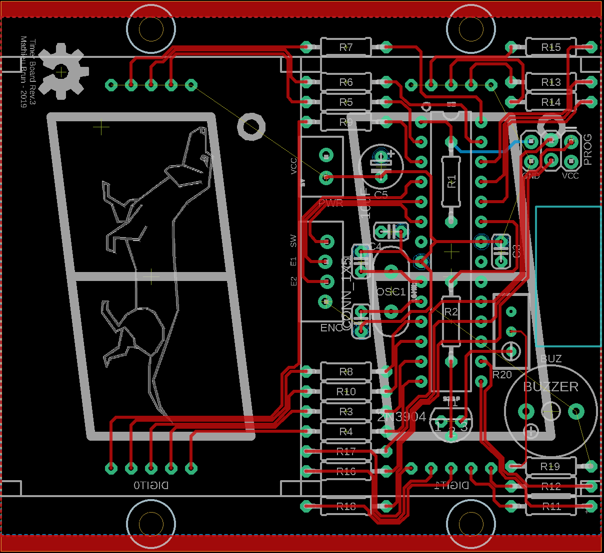

# arduino timer

WIP : Built the first version of the board. Some adjustment needed, see [Lessons learned](#Lessons-learned).

## Usage

TODO

## Schema

## Board

## Code features

TODO

### Lessons learned

- add markings on silkscreen with polarities when applicable
- check component orientation: rev3 of the board was born because the 7 segments were upside down
- check component sizes twice: I used the wrong capacitor footprint
- check that components on both sides of the board can fit: the 7 segments display feets were on top of pads of the resistors on the other side.
- check pin pitch twice: the power connector had 1mm pitch instead of 0.1".
- check side of enclosure before cutting, twice: of course I cut the wrong side...
- for components with wiring like the encoder, double check correct soldering
- [a buzzer may require a resistor](https://electronics.stackexchange.com/questions/6500/connecting-piezo-buzzer-with-bjt) !